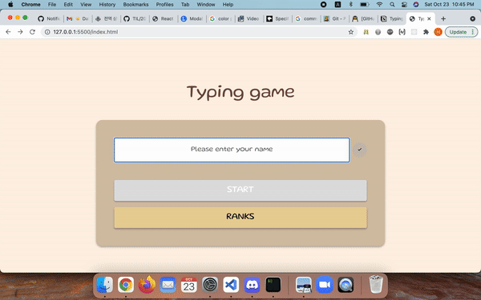

# Typing Game

## 개요
- n개의 단어를 따라치는 게임으로, 시간에 따른 기록과 순위를 보여주는 웹 앱
- HTML/CSS(Sass)/Javascript(바닐라)로 구현

## 목적
- 가독성 높은 코드를 구현한다.
- 전역 상태를 모듈 파일을 통해 관리한다.
- 작은 단위의 적절한 함수를 만들어 재사용한다.
- Git을 통한 협업 능력을 기른다.

## 시연

## 구현 기능

### 메인
- 게임에 사용할 username 입력 시 사용가능한 username인지 체크
- 모두 통과하면 username 반영한 환영메시지 띄우고 게임 입장버튼 활성화

### 게임
- 시간 경과 현황과 남은 단어 개수 텍스트 변경
- 단어 입력하여 submit 시 화면 변경
  - 오답인 경우: 에러메시지 출력
  - 정답인 경우: 다음 단어로 넘어가기

### 팝업
- 게임을 마치면 해당 기록을 반영한 메시지 팝업
  - 신기록인 경우: 폭죽 이펙트
  - 그 외의 경우: 일반적인 메시지

### 랭킹
- 기록이 없는 경우는 랭킹 테이블헤드를 가리고 기록없음 메시지 노출
- 이전(처음) 페이지, 다음(마지막) 버튼과 목록 번호로 페이지 이동
- 게임을 마치고 바로 넘어온 경우 동적 생성한 카드로 기록을 보여주고, 순위표에 하이라이트 처리 (메인페이지에서 넘어온 경우에는 별도의 표시 없음)

## 파일 구조 및 로직
### entry.js
- input에 username을 submit하면 중복 여부 및 영어로 4~12글자인지 체크
- 사용가능한 닉네임이라면 start 버튼에 자동으로 포커스

### game.js

- DOMContentLoaded시 게임을 시작하기 위한 카운트다운 3초 
- 게임에서 주어진 단어와 입력한 값이 일치하면 정답, 아니면 오류 메시지 노출
- 타이핑을 모두 마치면 게임 종료와 함께 유저네임과 기록 데이터 생성 
- localstorages에서 기존의 records를 가져와 새로 생성한 정보를 추가하여 기록을 기준으로 sort한 후 1등인지 아닌지 판별, 그 결과값에 따라 popup을 렌더링
- 업데이트된 records들은 랭킹 페이지를 위해 localStorage에 저장

### rank.js 
- localStorage에 저장해둔 currentUser 정보와 records를 가져와 렌더링
  - currentPage라는 상태의 값을 기준으로 몇 페이지의 5개 기록을 가져올지 결정
- DOMContentLoaded와 각 페이지를 이동하는 page-control 버튼 클릭 이벤트 발생 시 render 함수 호출
- beforeunload 이벤트 발생시 localStorage currentUser 정보를 "Anonymous"로 변경

### storage.js
- 로컬 스토리지 관련 함수, 로컬 스토리지에 사용되는 키를 위한 상수가 있다. get을 할땐 JSON.parse와 fallbackValue, set은 JSON.stringify 처리

### utils.js
- 2개 이상의 파일에서 사용하는 함수들을 관리(e.g. ms 형태의 정수를 mm:ss:ms로 변환)

### word.js
- game에서 사용하는 word관련 로직
- 단어 리스트(words)를 접근자 프로퍼티로 제공, 랜덤으로 word 1개를 참조하게 함.

